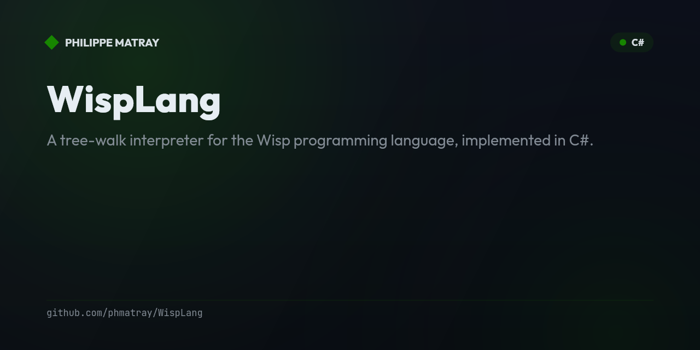

# WispLang

<!-- portfolio-badges:start -->
<!-- Identity -->
[](https://github.com/phmatray/WispLang)

[](https://github.com/phmatray/WispLang/stargazers)
[](https://github.com/phmatray/WispLang/network/members)
[](https://github.com/phmatray/WispLang/blob/HEAD/LICENSE)

<!-- Activity -->
[](https://github.com/phmatray/WispLang/issues)
[](https://github.com/phmatray/WispLang/pulls)
[](https://github.com/phmatray/WispLang/commits)
<!-- portfolio-badges:end -->

<!-- portfolio-toc:start -->

## Table of Contents

- [Description](#description)
- [Features](#features)
- [Getting Started](#getting-started)
- [Tech Stack](#tech-stack)
- [License](#license)
- [Contributing](#contributing)

<!-- portfolio-toc:end -->


> A tree-walk interpreter for the Wisp programming language, implemented in C#.

## Description
WispLang is a C# implementation of a tree-walk interpreter inspired by the Lox language from the book "Crafting Interpreters". It includes a scanner, AST generator, AST printer, and full interpreter — covering lexing, parsing, and evaluation of a custom scripting language.

## Features
- Full scanner/lexer for tokenizing Wisp source code
- Recursive-descent parser with AST generation
- Tree-walk interpreter with variable binding and function calls
- AST printer for debugging parse trees

## Getting Started
```bash
git clone https://github.com/phmatray/WispLang.git
cd WispLang
dotnet run --project WispScanner
```

<!-- portfolio-techstack:start -->

## Tech Stack

- **.NET 10**

<!-- portfolio-techstack:end -->

<!-- portfolio-roadmap:start -->

## Roadmap

Planned work and known limitations are tracked in the [open issues](https://github.com/phmatray/WispLang/issues). Contributions toward them are welcome.

<!-- portfolio-roadmap:end -->

## License
MIT

---

<!-- portfolio-sections:start -->

## Contributing

Contributions are welcome. Open an issue first to discuss any significant change.

1. Fork the repository and create your branch (`git checkout -b feat/my-feature`)
2. Commit your changes (`git commit -m 'feat: ...'`)
3. Push the branch and open a Pull Request

<!-- portfolio-sections:end -->
